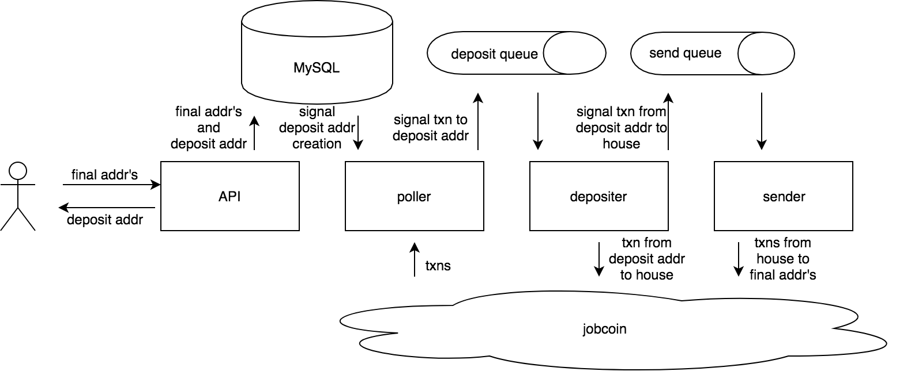

# jobcoin mixer
This is an extremely simple coin mixer. The user POSTS a list of addresses to the mixer and receives a single address to deposit coins into. Once the user deposits funds into the deposit address, the coins are transfered to the house, then the coins are evenly split up and sent from the house to the list of addresses.

## application architecture


### architecture description
#### API
This api receives the list of final addresses and generates the deposit address to send back to the user. It also sends the list of addresses and deposit address to MySQL to be stored.

#### MySQL
A database (AWS RDS) with a single table that stores:
 - deposit address
 - list of final addresses
 - boolean indicating whether deposit address has been deposited into yet

#### poller
Every second the poller does the following:
 - gets all txns from jobcoin via HTTP
 - gets a list of deposit addresses from MySQL with boolean flag false (has not been deposited to yet)
 - intersects the above two to get a list of deposit addresses that have just been deposited to
 - for each deposit address in the above intersection list, send a message to the deposit queue signaling that the address has just been deposited to
 - set boolean flag in MySQL flag to true

#### deposit queue
This message queue (AWS SQS) indicates which deposit addresses need their coins transfered to the house.

#### depositer
Watches for messages on the deposit queue and does the following:
 - transfer coins from deposit address to house
 - send a message to the send queue signaling that the above has been done

#### send queue
This message queue (AWS SQS) indicates which coins need to be transfered from the house to the final addresses.

#### sender
Watches for messages on the send queue and does the following:
 - gets final addresses from MySQL based on the deposit address
 - splits up deposited funds evenly and send to all final addresses

### architecture justification
This application seems a little complex, but I decided to center around message queues so I could separate logic between all the blocking operations (DB queries and HTTP requests to jobcoin), all while making the API responsive. Additionally, using MySQL and a message queue allows for persistence and fault tolerance, as any of the above services can be restarted without losing any data. Debugging is also easier because I can dissect each individual step by stopping any service and looking at the state of the MySQL table or the state of the message queues. Lastly, the separation of logic allows for an easier audit trail (just log steps in MySQL in the future).

## how to use
MySQL is running at `jobcoin-mysql.c7gn5ltapjua.us-east-1.rds.amazonaws.com`
Deposit queue is running at `https://sqs.us-east-1.amazonaws.com/976193603611/jobcoin-deposit`
Send queue is running at `https://sqs.us-east-1.amazonaws.com/976193603611/jobcoin-send`

Start API on port 3000: `npm start`
Start poller on port 3001: `PORT=3001 node poller.js`
Start depositer on port 3002: `PORT=3002 node depositer.js`
Start sender on port 3003: `PORT=3003 node sender.js`

Example:
```
$ curl -X POST -H "Content-Type: application/json" -d '{"addresses": ["test1", "test2"]}' localhost:3000/mixer
{"address":"43939c7df9276e5309d8e87668c94c112908e4c264a51866e88ce6b13eb3115a"}

$ curl -X POST -H "Content-Type: application/json" -d '{"fromAddress": "foo", "toAddress": "43939c7df9276e5309d8e87668c94c112908e4c264a51866e88ce6b13eb3115a", "amount": "50"}' http://jobcoin.gemini.com/wrongness/api/transactions
{"status":"OK"}

$ curl -s http://jobcoin.gemini.com/wrongness/api/transactions | python -m json.tool | tail -25 | head -24
    {
        "amount": "50",
        "fromAddress": "foo",
        "timestamp": "2017-12-12T20:08:36.887Z",
        "toAddress": "43939c7df9276e5309d8e87668c94c112908e4c264a51866e88ce6b13eb3115a"
    },
    {
        "amount": "50",
        "fromAddress": "43939c7df9276e5309d8e87668c94c112908e4c264a51866e88ce6b13eb3115a",
        "timestamp": "2017-12-12T20:08:38.593Z",
        "toAddress": "house"
    },
    {
        "amount": "25",
        "fromAddress": "house",
        "timestamp": "2017-12-12T20:08:39.922Z",
        "toAddress": "test1"
    },
    {
        "amount": "25",
        "fromAddress": "house",
        "timestamp": "2017-12-12T20:08:39.991Z",
        "toAddress": "test2"
    }
```
In the above example, we sent the addresses `test1` and `test2` to the API, which returned the deposit address `43939c7df9276e5309d8e87668c94c112908e4c264a51866e88ce6b13eb3115a`. When we deposited `50` coins from `foo` to the deposit address, those coins were automatically moved to `house` then from `house` to both `test1` and `test2`.

## to do

## security vulnerabilities
 - there is no TTL on the generated deposit addresses, making the application easily DoSable
 -- add a TTL on generated deposit addresses if they are not deposited into within `x` minutes
 - there is no delay on the transfer from deposit address to house or from house to final accounts, making the coins easily traceable
 -- add a bounded random delay on the transfer from deposit address to the house
 -- add bounded random delays from house to final accounts (to make sure delays aren't all the same)
 - funds are split evenly
 -- add a bounded random split of coins (to make sure funds sent aren't all the same)

## code cleanup
 - use promises instead of nested callbacks
 - hide AWS credentials...
 - probably some splitting up of functions

## application reliabilty
The SQS queue I used is at least once delivery, meaning duplicate messages can be sent during instability. The depositer already handles this because if it receives two messages telling it to transfer from a deposit address to the house address, the second transfer will simply fail because there are no funds left. However, the sender does not handle this possibility of duplicate messages. Duplicate messages will cause the house to lose money and for the user to receive extra money.
